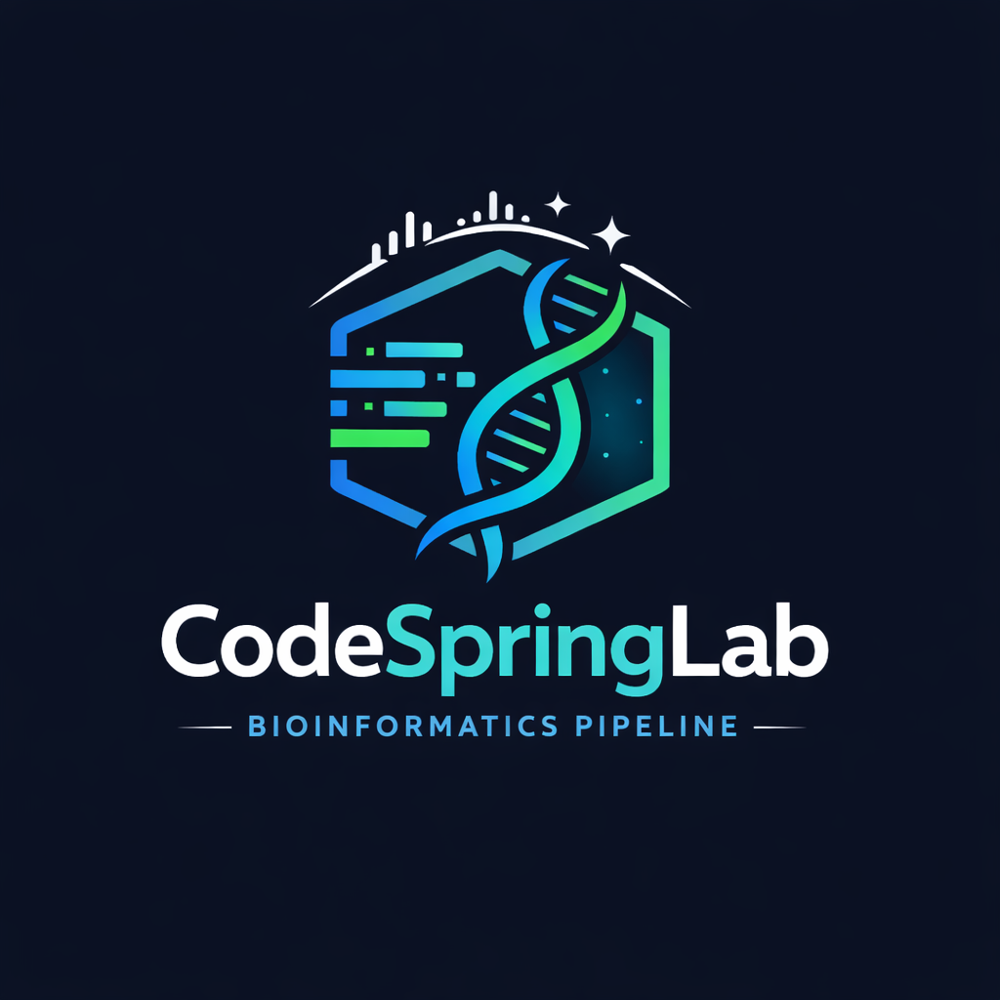
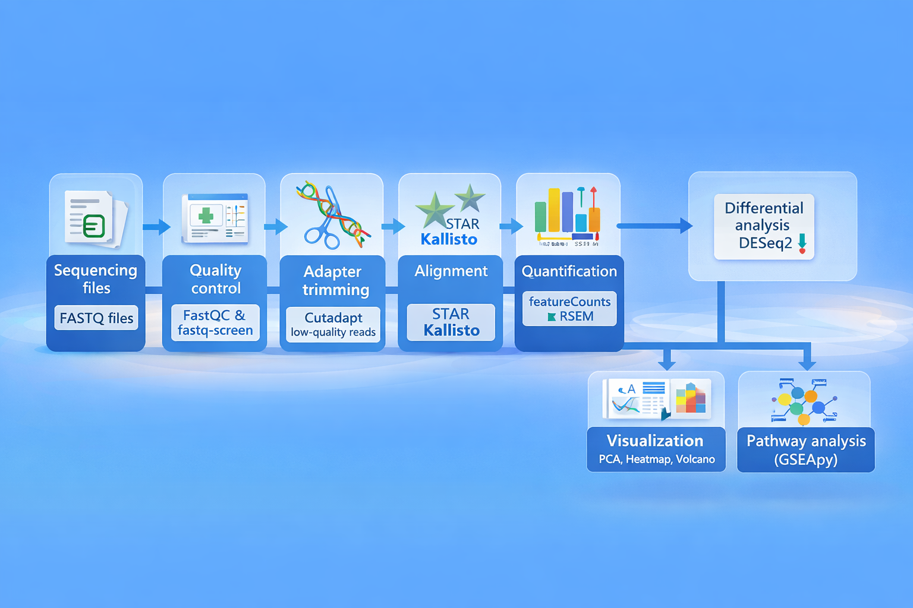
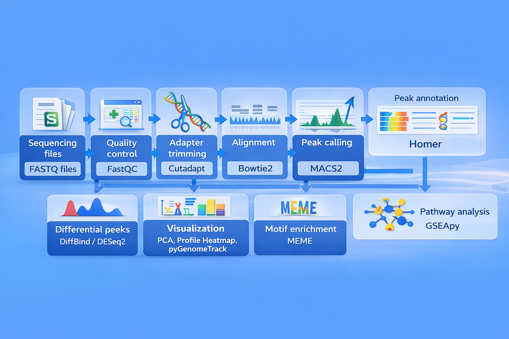

<p align="center">
  
</p>

# CodeSpringLab

CodeSpringLab is a collection of bulk sequencing workflows and helper scripts developed by the Bioinformatics Shared Resource at Cold Spring Harbor Laboratory.

Developed by Rad Utama, Alex Dobin, and James Rouse.

First release: March 2023

## What It Supports

- Bulk RNA-seq: read transfer, trimming, FastQC, STAR, featureCounts, DESeq2, GSEA, RSEM, Kallisto, and RNA-seq result visualization.
- Bulk ATAC-seq: read processing, alignment, QC, signal tracks, peak analysis, and downstream visualization.
- Bulk ChIP-seq: alignment, QC, peak workflows, and result organization.

## Recommended Install

Install CodeSpringLab in your home directory on the server:

```bash
cd ~
git clone https://github.com/jamesrouse1/CodeSpringLab.git
```

This location is recommended because CodeSpringLab project configs, notebooks, and the companion app are designed to find the repository cleanly from `~/CodeSpringLab`.

## Recommended Results Viewer

CodeSpringApp is the recommended way to create projects, run RNA-seq pipeline steps, track SLURM jobs, inspect logs, and visualize results. It is not required to run CodeSpringLab notebooks directly, but it is the best way to review outputs and avoid manually typing repeated notebook prompts.

Install CodeSpringApp in your home directory as well:

```bash
cd ~
git clone https://github.com/jamesrouse1/CodeSpringApp.git
```

Then launch it from the server:

```bash
cd ~/CodeSpringApp
./run_codespringweb.sh
```

The launcher prints the SSH tunnel command to paste into your laptop terminal and the local browser URL to open.

## Repository Layout

```text
CodeSpringLab/
├── bulkRNAseq/             # RNA-seq notebook workflow
├── bulkATACseq/            # ATAC-seq notebook workflow
├── bulkChIPseq/            # ChIP-seq notebook workflow
└── scripts_DoNotTouch/     # Pipeline scripts, Shiny viewer, configs, and references
```

## Bulk RNA-seq

<p align="center">
  
</p>

The RNA-seq workflow includes trimming, QC, alignment, quantification, differential expression, pathway analysis, and visualization through the RNA-seq Results Explorer.

## Bulk ATAC-seq

<p align="center">
  
</p>

The ATAC-seq workflow organizes read processing, alignment, QC metrics, signal tracks, and downstream peak-based analysis.

## Bulk ChIP-seq

<p align="center">
  
</p>

The ChIP-seq workflow supports single- and paired-end alignment, duplicate-removed CPM signal tracks, explicit target-to-input matching, MACS2 narrow or broad peak calling, and DiffBind/DESeq2 differential binding. It uses the current mouse GRCm39/GENCODE M39 and human GRCh38/GENCODE v50 Bowtie2 and annotation resources; legacy M29, v42, and mm10 references are not used by the ChIP workflow.

## Typical Server Setup

For the cleanest setup, keep both repositories next to each other in your home directory:

```text
~
├── CodeSpringLab/
└── CodeSpringApp/
```

CodeSpringLab performs the analysis. CodeSpringApp provides the point-and-click interface for setup, execution, monitoring, logs, and visualization.

## Tests

Run the complete local smoke suite from the repository root:

```bash
bash tests/run_all.sh
```

The suite exercises the RNA runner chain with controlled fake external tools, including Cutadapt, FastQC, STAR, featureCounts, Kallisto, and RSEM; CUT&RUN post-alignment repair; peak calling and differential peaks; pooled FASTQ handling; completion and failure behavior; and the bundled SEACR R algorithm on synthetic bedGraph data. The fake-tool tests validate CodeSpringLab orchestration without requiring cluster modules; the SEACR test executes the bundled caller itself.
